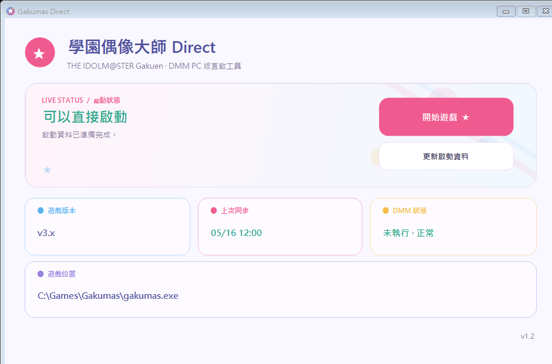

# Gakumas Direct Launcher

[English](README_EN.md)

一個專為 DMM GAMES PC 版《學園偶像大師》設計的輕量啟動器，提供一個快速啟動遊戲的方式取代 DMM 啟動。

平常使用上一次由官方 DMM 成功產生的啟動資料，直接開啟 `gakumas.exe`；只有遊戲需要更新、登入失效或啟動資料失效時，才需要再次開啟 DMM。



## 需求

- Windows
- .NET Framework 4.8
- 已安裝官方 DMM Game Player
- 已透過 DMM 安裝《學園偶像大師》PC 版

## 第一次使用

1. 先連上可使用 DMM 的日本網路出口。
2. 從官方 DMM Game Player 成功啟動《學園偶像大師》一次。
3. 關閉 DMM。
4. 執行 `GakumasDirectLauncher.exe`。
5. 按「開始遊戲」。

程式會自動從下列固定位置讀取最新的學園偶像大師啟動紀錄：

```text
%APPDATA%\dmmgameplayer5\logs\dll.log
```

日誌紀錄會提供 `gakumas.exe` 路徑與四項必要啟動資料，因此不需要手動指定遊戲資料夾。

## 日常使用

主畫面只有兩個操作：

- **開始遊戲**：使用 Windows 加密保存的資料直接啟動遊戲，不開啟 DMM。
- **更新啟動資料**：讀取 DMM 最新紀錄；確認取得新資料後更新快取並關閉 DMM。

若畫面顯示：

```text
Token 過期／遊戲需要更新
請開啟 DMM 並啟動一次遊戲，完成後按「更新啟動資料」。
```

請依序操作：

1. 連上日本網路出口。
2. 手動開啟官方 DMM。
3. 讓 DMM 完成更新，並從 DMM 啟動遊戲一次。
4. 回到本工具，按「更新啟動資料」。

如果沒有偵測到新的 DMM 啟動紀錄，工具不會覆蓋現有資料，也不會關閉 DMM。

## 安全與隱私

- 不讀取 DMM 帳號密碼。
- 不解密或保存 DMM 帳號 `accessToken`。
- 不呼叫 DMM API，不上傳任何資料。
- `viewer_id`、`onetime_token`、`open_id`、`pf_access_token` 使用 Windows DPAPI CurrentUser 加密。
- 工具日誌不記錄上述四項資料。
- 更新前會確認 DMM 日誌確實出現新的啟動紀錄。
- Release ZIP 使用明確白名單建立，不包含本機設定、DMM 日誌或憑證。

詳細說明請參閱 [SECURITY.md](SECURITY.md)。

## 已知限制

- 工具無法取得 DMM 的正式錯誤碼，因此不會區分原始原因是 Token、遊戲版本或其他問題。
- 遊戲程序持續執行 35 秒即視為啟動成功。若遊戲停在錯誤畫面但程序未結束，請手動完成 DMM 更新流程。
- 更新遊戲、重新登入或取得新啟動資料時，仍需要官方 DMM 與可使用 DMM 的網路出口。

## 從原始碼建置

在 Windows PowerShell 執行：

```powershell
powershell.exe -NoProfile -ExecutionPolicy Bypass -File .\build.ps1
```

建置會：

1. 編譯 `GakumasDirectLauncher.exe`。
2. 執行核心測試。
3. 分別以 `zh-CN` 與 `en-US` 測試 GUI，確認繁體中文／英文切換、文字重疊與按鈕截字。
4. 產生 EXE SHA-256。
5. 建立包含 EXE 與完整原始碼的 Release ZIP。

主要輸出：

```text
dist\GakumasDirectLauncher.exe
release\GakumasDirectLauncher-v1.2.0.zip
artifacts\SHA256SUMS.txt
```
