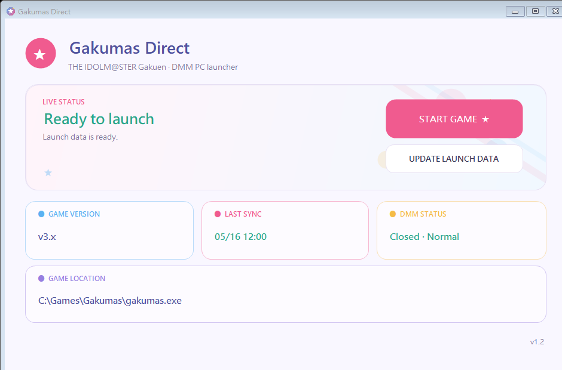

# Gakumas Direct Launcher

[繁體中文](README.md)

A lightweight launcher made specifically for the DMM GAMES PC version of **THE IDOLM@STER Gakuen**.

During normal use, it reuses the latest launch data generated by the official DMM Game Player and starts `gakumas.exe` directly. DMM is only needed again when the game must be updated, the DMM login expires, or the launch data becomes invalid.



## Requirements

- Windows
- .NET Framework 4.8
- The official DMM Game Player installed
- THE IDOLM@STER Gakuen PC version installed through DMM

## First use

1. Connect through a Japanese network route that can access DMM.
2. Launch THE IDOLM@STER Gakuen successfully from the official DMM Game Player once.
3. Close DMM.
4. Run `GakumasDirectLauncher.exe`.
5. Click **START GAME**.

The launcher automatically reads the latest game launch record from:

```text
%APPDATA%\dmmgameplayer5\logs\dll.log
```

That record contains the full `gakumas.exe` path and the four required launch values, so no manual game-folder selection is needed.

## Normal use

The main window contains only two actions:

- **START GAME**: starts the game with Windows-protected cached data without opening DMM.
- **UPDATE LAUNCH DATA**: imports a new DMM launch record, updates the protected cache, and closes DMM after a successful update.

If the launcher displays:

```text
Token expired / Game update required
Open DMM and launch the game once, then click UPDATE LAUNCH DATA.
```

Follow these steps:

1. Connect through a Japanese network route.
2. Open the official DMM Game Player manually.
3. Let DMM finish any update and launch the game once from DMM.
4. Return to this launcher and click **UPDATE LAUNCH DATA**.

If no new DMM launch record is detected, the existing cache is not overwritten and DMM is not closed.

## Security and privacy

- Does not read DMM passwords.
- Does not decrypt or store the DMM account `accessToken`.
- Does not call DMM APIs or upload any data.
- Protects `viewer_id`, `onetime_token`, `open_id`, and `pf_access_token` with Windows DPAPI CurrentUser encryption.
- Never writes those four values to its own log.
- Updates the cache only after detecting a genuinely new DMM launch record.
- Builds the Release ZIP from an explicit allowlist, excluding local settings, DMM logs, and credentials.

See [SECURITY.md](SECURITY.md) for details.

## Known limitations

- The launcher does not receive official DMM error codes, so it cannot determine whether the original cause was an expired token, a game update, or another failure.
- A game process that remains alive for 35 seconds is considered a successful launch. If the game stays open on an error screen, complete the DMM refresh flow manually.
- The official DMM client and a usable DMM network route are still required for game updates, login renewal, and fresh launch data.

## Build from source

Run this command in Windows PowerShell:

```powershell
powershell.exe -NoProfile -ExecutionPolicy Bypass -File .\build.ps1
```

The build script:

1. Compiles `GakumasDirectLauncher.exe`.
2. Runs the core test suite.
3. Tests the GUI under simulated `zh-CN` and `en-US` cultures for language selection, overlapping text, and clipped buttons.
4. Generates the EXE SHA-256.
5. Creates a Release ZIP containing both the executable and the complete source code.

Main outputs:

```text
dist\GakumasDirectLauncher.exe
release\GakumasDirectLauncher-v1.2.0.zip
artifacts\SHA256SUMS.txt
```
